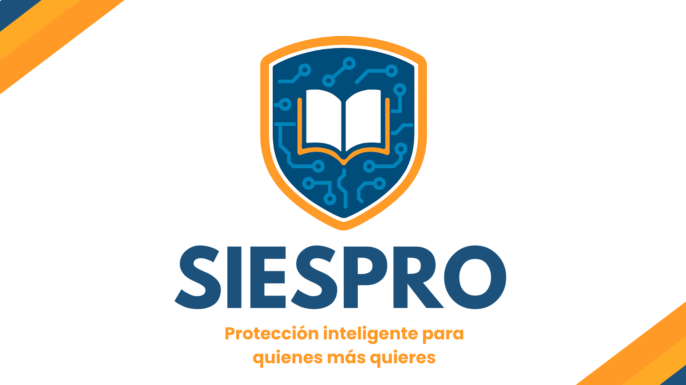
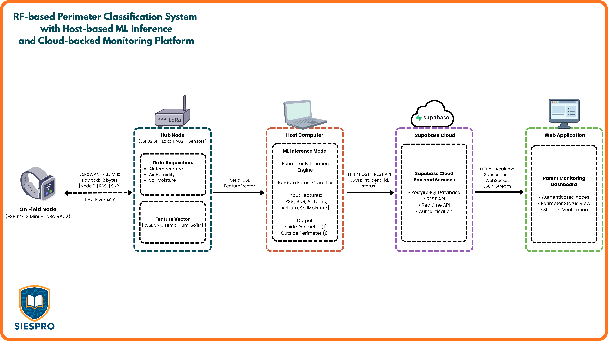

# SIESPRO

  

  <em>Sistema Inteligente de Seguridad y Permanencia Escolar</em>

  
  
  
  
  
  
  
  

---

SIESPRO is an interdisciplinary student project developed at the
[National University of Colombia — Bogotá campus](https://unal.edu.co/)
and presented at **TPI EXPOIDEAS 2025**, the university's annual innovation fair.
The project addresses a tangible problem in Colombian school environments:
**guaranteeing the physical safety of students without compromising their privacy.**

The solution combines IoT hardware, LoRa wireless communication, environmental
sensing, and a Machine Learning model trained from scratch — correlating
ambient variables (temperature, humidity, soil moisture) with RF link-quality
metrics (RSSI, SNR) to classify whether a student node is inside or outside
a defined perimeter. No GPS, no cameras, no biometric data.

Beyond the technical development, SIESPRO was structured as a **simulated
startup**, applying agile methodologies including **Design Thinking**,
**PESTEL analysis**, **Kanban**, **EDT**, **TRL**, and stakeholder-centered
divergence and convergence stages. A survey conducted with parents and school
administrators validated the problem and confirmed demand for a
privacy-preserving approach before any technical work began.

> Visit the project website: [ssiespro.wixsite.com/website-159](https://ssiespro.wixsite.com/website-159)

---

## System Architecture

  

The On Field Node (ESP32-C3 Mini) exchanges LoRa packets with the Hub Node
(ESP32 + sensors). The Hub extracts RSSI and SNR from each ACK frame, bundles
them with local sensor readings, and sends the feature vector to a cloud-hosted
Random Forest classifier via HTTPS. The inference result feeds a real-time
parent-facing dashboard backed by Supabase.

---

## Team

SIESPRO was built by a genuinely interdisciplinary team, with each member
assigned a startup role matching their engineering background:

| Role | Name | Discipline |
|---|---|---|
| CEO | Luis Guillermo Vaca Rincón | Electronic Engineering |
| CTO | Rosemberth Steeven Preciga Puentes | Electronic Engineering |
| CFO | Andrés Felipe Castillo Caicedo | Mechanical Engineering |
| COO | Daniela Martínez Sierra | Civil Engineering |
| CCO | Miguel Alejandro Bermúdez Claros | Agricultural Engineering |
| CMO | Camila Stefany Garzón Parra | Anthropology |

---

## Repository Structure

| Folder | Contents |
|---|---|
| `hardware/` | All ESP32 firmware — master node, slave node, sensor tests and basic link tests. Each subfolder contains its own README with pin mappings, operating modes and flash instructions. |
| `frontend_backend/` | Web dashboard (parent monitoring UI) and Supabase backend — REST API, real-time subscriptions and PostgreSQL schema. |
| `3D_models/` | Enclosure and mounting models for the hardware nodes. |
| `docs/` | Project documentation — academic poster (TPI EXPOIDEAS 2025), business plan, PESTEL analysis, infographic, architecture diagram and hardware photographs. |
| `assets/` | Shared visual resources — logos and diagrams referenced across the repository. |

Each folder contains a dedicated `README.md`. Start with the folder most
relevant to your interest; the sections below suggest entry points by role.

---

## Entry Points by Role

**I want to understand the project**
→ Read `docs/README.md` and review `docs/siespro_poster.pdf`

**I want to run the hardware**
→ Start at `hardware/README.md` → follow the recommended reading order inside

**I want to explore the ML model or backend**
→ Go to `frontend_backend/README.md`

**I want to see the physical device**
→ See `docs/siespro_sensor_node.jpg`

---

## Methodologies

| Methodology | Application in SIESPRO |
|---|---|
| Design Thinking | Divergence / convergence stages — problem framing and solution validation with stakeholders |
| PESTEL | Viability analysis across political, economic, social, technological, environmental and legal dimensions |
| Kanban | Sprint task management across the team |
| EDT (WBS) | Work breakdown structure for project planning |
| TRL | Technology readiness level tracking from concept to demo |
| Stakeholder mapping | Parents, school administrators and students as primary stakeholders |

---

## Disclaimer

SIESPRO is an academic research project developed for educational purposes.
System effectiveness depends on site-specific calibration and labeled data
collection. The system is designed to assist institutional safety efforts
and is **not intended for surveillance, behavioral tracking, or any use
outside a consensual, institutional safety context.**
