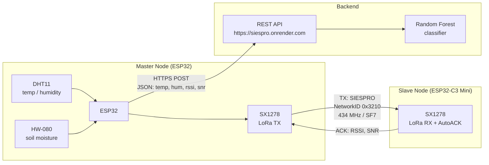

# SIESPRO — Hardware Subsystem

Embedded firmware for the SIESPRO perimeter monitoring system.
Implements a point-to-point LoRa network between a master node (ESP32) and a
slave node (ESP32-C3 Mini) using Reliable Transmission with AutoACK.
The link-quality metrics extracted from each ACK — RSSI and SNR — serve as
features for a Random Forest classifier that determines whether the transmitter
is inside or outside a defined perimeter.

> **Sensor data is never transmitted over LoRa.** The radio link is used solely
> as a measurement instrument to extract spatial RF features (RSSI, SNR).
> Environmental data (temperature, humidity, soil moisture) is read locally by
> the master node and sent directly to the backend API via HTTPS.

---

## System Architecture

---

## Repository Structure

| Folder | Target Hardware | Purpose |
|---|---|---|
| `basic_tests/` | ESP32 + ESP32-C3 Mini | Point-to-point link validation |
| `master_esp32/` | ESP32 | Main firmware — three operating modes |
| `slave_esp32_mini/` | ESP32-C3 Mini | AutoACK responder — passive |
| `sensors_esp32/` | ESP32 | Isolated sensor verification |
| `library/` | — | SX12XX-LoRa driver (Stuart Robinson) |

---

## Hardware Requirements

| Component | Model | Qty | Role |
|---|---|---|---|
| Microcontroller | ESP32 DevKit v1 | 1 | Master node |
| Microcontroller | ESP32-C3 Mini | 1 | Slave node |
| LoRa transceiver | SX1278 (433 MHz) | 2 | RF link |
| Air sensor | DHT11 | 1 | Temperature + humidity |
| Soil sensor | HW-080 | 1 | Soil moisture (optional) |

---

## Prerequisites

- [PlatformIO IDE](https://platformio.org/install/ide?install=vscode) (VSCode extension)
- Python 3.10+ — required only for `IA_config/dataset_tool/collect_dataset.py`
- `pyserial` — `pip install pyserial`

No additional library installation is needed. The SX12XX-LoRa driver is
vendored locally under `library/` and resolved automatically by PlatformIO
via `lib_extra_dirs` in each `platformio.ini`.

---

## Recommended Reading Order

Follow this order when setting up the system for the first time:

1. `library/` — understand the LoRa driver being used
2. `sensors_esp32/` — verify each sensor independently
3. `basic_tests/` — validate the LoRa link before adding logic
4. `slave_esp32_mini/` — flash the slave node (unchanged across modes)
5. `master_esp32/ACK_config/` — validate AutoACK end-to-end
6. `master_esp32/IA_config/` — collect the training dataset
7. `master_esp32/API_config/` — deploy online inference

